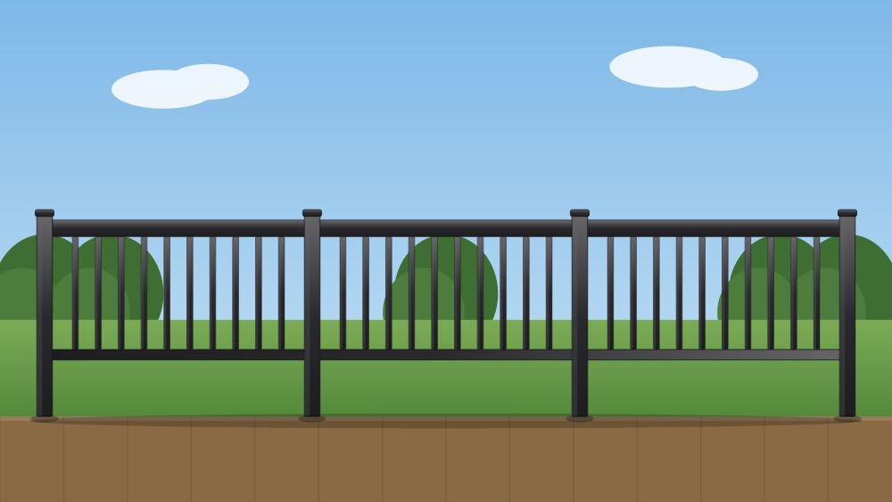

# Kadenz Deck Railing Visualizer (Replica)

An interactive deck-railing visualizer inspired by the
[Kadenz Aluminum Railings Deck Visualizer](https://kadenzrailing.com/visualizer/).
Design an aluminum railing and preview it in real time on a styled deck scene —
or on a photo of your own deck.

The railing is **rendered live as SVG** from your selections (no pre-baked product
photos), so every combination of line, infill, finish, top rail and post size
produces a fresh, crisp preview.



## Features

- **Railing lines** — Kadenz Classic, Elegance, Commercial (each with its own profile weight & default top rail)
- **Infill styles** — Picket balusters, tempered Glass panels (with spigots & reflections), horizontal Cable
- **Finishes** — Matte Black, Bright White, Bronze, Sandstone (architectural-grade powder coat look, rendered with metal gradients)
- **Top rail profiles** — Flat (square) and Crowned (rounded premium)
- **Posts & spacing** — 2", 2½", 3½" post sizes; post-to-post or continuous-span rail style
- **Scenes** — Backyard, Lakeside, Patio (city skyline + string lights), Twilight — all stylized SVG
- **Upload your own deck photo** and overlay the railing on top
- **Save image** — rasterizes the live preview (and any uploaded photo) to a PNG download
- **Live configuration summary** and a quote call-to-action

## Run it

No build step — it's a static site.

```bash
npm start          # serves on http://localhost:5173
# or
python3 -m http.server 5173
```

Then open <http://localhost:5173>.

## How it works

- `index.html` — layout: header, hero, preview stage, scene strip, and the configurator panel
- `styles.css` — dark, brand-styled UI
- `app.js`
  - `SCENES` / `sceneSVG()` — stylized SVG backgrounds
  - `railingSVG()` — builds posts, rails, top-rail profile and infill from `state`, with
    per-finish metal gradients (`shade()` lightens/darkens the base hex)
  - `renderInfill()` — picket / glass / cable geometry between each pair of posts
  - `buildUI()` / `render()` — wires the configurator and re-renders on every change

## Notes

This is a demonstration replica. The original Kadenz visualizer is powered by a
third-party photo-compositing service; this build reproduces the *experience*
(configure → live preview → save/quote) with original SVG rendering rather than
proprietary product imagery. **Kadenz®** is a trademark of its respective owner.
